# Compte Rendu — TP Réseaux : Programmation par Sockets

**Binôme :** AbdelAziz Mseddi (serveur) + binôme (client)  
**Date :** 29 avril 2026  
**Plateforme de test :** loopback (127.0.0.1), Linux

---

## Partie 1 — Observation HTTP avec telnet et tcpdump

### Protocole observé

On utilise `python3 -m http.server 8000` comme serveur HTTP/1.0 et `telnet 127.0.0.1 8000` comme client manuel.

### Comment s'établit la connexion TCP ?

La connexion TCP s'établit via le **3-way handshake** en 3 étapes avant tout échange HTTP :

1. Le **client** envoie un segment `SYN` pour initier la connexion
2. Le **serveur** répond par un `SYN-ACK` pour confirmer
3. Le **client** envoie un `ACK` pour valider

Ce n'est qu'après ces 3 échanges que les données applicatives (la requête HTTP) peuvent circuler. HTTP n'a pas de mécanisme de connexion propre — il utilise simplement la connexion TCP déjà établie.

### Chronogramme complet TCP/HTTP



### Quels ports sont utilisés ?

| Côté    | Port                                 | Type                                              |
| ------- | ------------------------------------ | ------------------------------------------------- |
| Serveur | **8000** (ou 80 en production)       | Port fixe, connu à l'avance                       |
| Client  | **port éphémère** (ex. 47986, 48420) | Assigné aléatoirement par le kernel (49152–65535) |

### Test 1a — Requête HEAD

**Commande client :**

```
HEAD / HTTP/1.1
Host: localhost
<ligne vide>
```

**Réponse du serveur :**

```
HTTP/1.0 200 OK
Server: SimpleHTTP/0.6 Python/3.12.3
Date: Wed, 29 Apr 2026 19:28:10 GMT
Content-type: text/html; charset=utf-8
Content-Length: 441
```

→ `Connection closed by foreign host.`

**Observation :** HEAD retourne uniquement les en-têtes, sans le corps. Le `Content-Length: 441` indique la taille du corps qui aurait été envoyé par un GET, mais aucun octet de corps n'est transmis.

### Test 1b — Requête GET

**Réponse du serveur :** en-têtes + corps HTML (listing du répertoire, 441 octets).  
Le serveur ferme aussi la connexion après l'envoi.

### Tests visuels — client_http (client C programmatique)

Le client C (`client_http`) effectue les mêmes requêtes de façon automatisée. On observe le même comportement que telnet mais sans saisie manuelle.

**HEAD /message.txt :**


Seuls les en-têtes sont reçus (154 octets) — `Content-Length: 574` indique la taille du corps mais HEAD ne l'envoie pas.

**GET /message.txt :**


Le corps complet est reçu (728 octets = 154 octets d'en-têtes + 574 octets de corps Lorem Ipsum).

### Chronogramme tcpdump (HEAD, port 8000)

```
Client (port 47986)                     Serveur (port 8000)
       |                                       |
       |──── SYN ─────────────────────────────>|  [S]  seq=3012740848
       |<─── SYN-ACK ──────────────────────────|  [S.] seq=185757018, ack=3012740849
       |──── ACK ─────────────────────────────>|  [.]  ack=1
       |                                       |
       |──── HEAD / HTTP/1.1\r\n ─────────────>|  [P.] length=17
       |<─── ACK ──────────────────────────────|  [.]
       |──── Host: localhost\r\n ─────────────>|  [P.] length=17
       |<─── ACK ──────────────────────────────|  [.]
       |──── \r\n ────────────────────────────>|  [P.] length=2
       |<─── ACK ──────────────────────────────|  [.]
       |<─── HTTP/1.0 200 OK\r\n... ───────────|  [P.] length=155
       |──── ACK ─────────────────────────────>|  [.]
       |<─── FIN ──────────────────────────────|  [F.] ← serveur ferme
       |──── FIN ─────────────────────────────>|  [F.]
       |<─── ACK ──────────────────────────────|  [.]
       |                                       |
```

**Extrait tcpdump réel :**

```
20:28:10.436081 IP localhost.8000 > localhost.47986: Flags [F.], seq 156, ack 37
20:28:10.436186 IP localhost.47986 > localhost.8000: Flags [F.], seq 37, ack 157
20:28:10.436267 IP localhost.8000 > localhost.47986: Flags [.], ack 38
```

### Qui ferme la connexion ? Quand ?

C'est le **serveur HTTP** qui initie la fermeture, immédiatement après avoir envoyé la réponse complète. La fermeture TCP se fait en **4 étapes** :

1. **Serveur → Client** : `FIN` — le serveur n'a plus rien à envoyer
2. **Client → Serveur** : `ACK` — le client accuse réception du FIN
3. **Client → Serveur** : `FIN` — le client ferme sa propre moitié
4. **Serveur → Client** : `ACK` — confirmation finale

> En HTTP/1.0, la connexion est fermée après chaque requête/réponse. En HTTP/1.1, le serveur peut la maintenir ouverte (`Connection: keep-alive`) pour plusieurs échanges, mais dans notre cas le serveur ferme dès la fin de la réponse.

---

## Partie 2 — Outils réseau : telnet, netcat, tcpdump

| Outil     | Usage dans le TP                                       |
| --------- | ------------------------------------------------------ |
| `telnet`  | Client TCP manuel — envoie du texte brut sur un port   |
| `nc`      | Client TCP/UDP léger pour tester rapidement un serveur |
| `tcpdump` | Capture et affiche les paquets réseau en temps réel    |

### Flags tcpdump observés

| Flag    | Signification                            |
| ------- | ---------------------------------------- |
| `[S]`   | SYN — demande de connexion               |
| `[S.]`  | SYN-ACK — acceptation de connexion       |
| `[.]`   | ACK pur — acquittement seul              |
| `[P.]`  | PSH+ACK — données + acquittement         |
| `[F.]`  | FIN+ACK — fermeture de connexion         |
| `[FP.]` | FIN+PSH — données + fermeture (fusionné) |

### Comparaison telnet vs client C programmatique

En refaisant la capture avec `telnet` à la place du programme C, on observe **exactement le même chronogramme TCP/HTTP**.

| Critère                  | Client C (`client_http`)      | `telnet`                             |
| ------------------------ | ----------------------------- | ------------------------------------ |
| Port source              | Port éphémère aléatoire       | Port éphémère aléatoire (différent)  |
| Délai avant requête HTTP | Quasi-nul (`send()` immédiat) | Plusieurs secondes (saisie manuelle) |
| Envoi de la requête      | Un seul segment TCP           | Peut fragmenter si on tape lentement |
| Protocole TCP/HTTP       | Identique                     | Identique                            |

`telnet` est simplement un **client TCP générique** : il ouvre une socket TCP, puis transmet tout ce que l'utilisateur tape octet par octet. Le programme C fait exactement la même chose via `send()`. Le protocole réseau sous-jacent est **strictement identique** dans les deux cas — même handshake, même échange HTTP, même fermeture FIN/ACK. La seule différence est que notre programme envoie la requête en un seul appel `send()`, alors que `telnet` peut la fragmenter si on tape lentement.

---

## Partie 3 — Serveur TCP séquentiel (`server_tcp.c`)

### Architecture

```
main()
  └── socket() → bind() → listen()
  └── while(1):
        └── accept()         ← bloque jusqu'à une connexion
        └── handle_client()  ← bloque 60 secondes
        └── close()          ← ferme la connexion
        └── retour à accept() ← attend le client suivant
```

**Limitation :** un seul client à la fois. Le deuxième client attend dans la file `listen()` pendant les 60 secondes.

### Servir plusieurs clients — file d'attente et saturation (BACKLOG)

**Peut-on servir plusieurs clients simultanément ?**  
Non. Le serveur séquentiel bloque 60 secondes dans `handle_client()` avant de retourner à `accept()`. Pendant ce temps, les autres clients attendent dans la **file de connexions pendantes** de `listen()` dont la taille est limitée par `BACKLOG = 10`.

```
Client 1 ──────────────── servi (60s) ──────────────────>
Client 2               [file listen()] ─── attend ───────> servi à t+60s
Client 3               [file listen()] ─── attend ───────>           servi à t+120s
...
Client 10              [file listen()] ─── attend ───────>
Client 11              ECONNREFUSED ← file pleine, refusé immédiatement
```

**Que se passe-t-il si on lance un client supplémentaire quand la file est pleine ?**  
Le noyau refuse la connexion directement au niveau TCP sans que le programme serveur n'intervienne. Le client reçoit l'erreur **`ECONNREFUSED`** et son `connect()` échoue immédiatement. Cette limitation est la motivation principale de la partie 5 : le serveur concurrent via `fork()` vide la file quasi instantanément en déléguant chaque client à un fils, rendant la saturation de la file pratiquement impossible.

### Test 2 — TCP avec sleep(1)

**Serveur :** `./server_tcp` (avec `sleep(1)` actif)

**Résultat client :**

```
[OK] Connecté à 127.0.0.1:8080
[Envoyé] Bonjour
Il est 21:18:30 !
Il est 21:18:31 !
...
Il est 21:19:29 !
Au revoir
recv() appelé 61 fois (TCP peut fusionner plusieurs messages)
```

**Analyse :**

- 61 appels à `recv()` = 60 messages horaires + 1 "Au revoir"
- Chaque message fait **18 octets** : `"Il est HH:MM:SS !\n"` = 18 caractères
- Le `sleep(1)` garantit qu'un seul `send()` est en vol à la fois → TCP ne peut pas fusionner

**Extrait tcpdump (avec sleep) :**

```
21:18:30 Flags [P.] length=18  → Il est 21:18:30 !
21:18:31 Flags [P.] length=18  → Il est 21:18:31 !
21:18:32 Flags [P.] length=18  → Il est 21:18:32 !
...
21:19:29 Flags [P.] length=18  → Il est 21:19:29 !
21:19:30 Flags [P.] length=10  → Au revoir
21:19:30 Flags [F.]            → fermeture serveur
```

### Test 3 — TCP sans sleep (fusion de segments)

**Modification :** `sleep(1)` commenté dans `server_tcp.c`.

**Résultat client :**

```
recv() appelé 19 fois (TCP peut fusionner plusieurs messages)
```

Tous les messages affichent `21:28:37` — envoyés quasi instantanément.

**Analyse tcpdump (sans sleep) :**

```
Flags [P.] length=18   → Il est 21:28:37 !          (1 message)
Flags [P.] length=18   → Il est 21:28:37 !          (1 message)
Flags [P.] length=54   → Il est ... ! × 3           (3 fusionnés)
Flags [P.] length=36   → Il est ... ! × 2           (2 fusionnés)
Flags [P.] length=36   → Il est ... ! × 2
Flags [P.] length=36   → Il est ... ! × 2
...
Flags [P.] length=72   → Il est ... ! × 4           (4 fusionnés)
Flags [FP.] length=10  → Au revoir + FIN            (data+fermeture)
```

**Explication du phénomène de fusion TCP :**

TCP est un **flux d'octets continu** — il n'a pas conscience des frontières entre `send()`. L'algorithme de Nagle regroupe les petits segments en attente de l'ACK du segment précédent. Quand les 60 `send()` sont émis sans délai, le noyau en accumule plusieurs dans un même segment TCP pour optimiser le réseau.

**Conséquence :** un seul `recv()` côté client peut recevoir plusieurs messages à la fois. C'est pourquoi **on ne peut pas supposer que 1 send() = 1 recv() en TCP**.

**Avec sleep(1) :** chaque message part seul → 61 `recv()`.  
**Sans sleep :** TCP fusionne → seulement 19 `recv()` pour 61 messages.

### Chronogramme TCP (fermeture)

```
Serveur                          Client
   |                               |
   |─── "Au revoir\n" ────────────>|  [P.] length=10
   |─── FIN ──────────────────────>|  [F.] ← serveur initie fermeture
   |<── FIN ───────────────────────|  [F.] ← client répond
   |─── ACK ──────────────────────>|  [.]
   |                               |
```

**Qui ferme la connexion TCP ?** Le **serveur** : après l'envoi de "Au revoir", `close(client_fd)` envoie un `FIN`.

### Que se passe-t-il si on débranche le câble réseau ?

Ce test n'a pas pu être réalisé en loopback (même machine, pas de câble physique), mais le comportement TCP est le suivant :

**Câble débranché :**

```
Programme              Noyau (kernel)               Réseau
    |                       |                          |
    | send("Il est...")      |                          |
    |──────────────────────>|                          |
    |                       |──── segment TCP ─────────X  (perdu)
    |                       |  pas d'ACK... attend     |
    |                       |──── retransmission ──────X  (perdu)
    |                       |  attend 2× plus longtemps|
    |                       |──── retransmission ──────X  (perdu)
    |                       |       ...                |
    |  ETIMEDOUT (~15 min)  |                          |
    |<──────────────────────|                          |
```

Le programme ne voit rien pendant plusieurs minutes — `send()` ne retourne pas d'erreur immédiatement. Le noyau garde une copie de chaque segment dans son **buffer de retransmission** et les réenvoie périodiquement en doublant le délai à chaque échec (200ms → 400ms → 800ms → ...). C'est le kernel qui gère cela, pas le programme. Après environ 15 minutes sans ACK, `send()` retourne finalement `-1` avec l'erreur `ETIMEDOUT` ou `EPIPE`.

**Câble débranché puis rebranché rapidement :**

Si le câble est rebranché avant que les retransmissions n'atteignent leur limite, TCP reprend automatiquement là où il s'était arrêté. La connexion survit sans interruption visible pour le programme — c'est précisément la garantie de fiabilité de TCP.

---

## Partie 4 — Serveur UDP (`server_udp.c`)

### Différences fondamentales TCP vs UDP

| Critère             | TCP (`SOCK_STREAM`)               | UDP (`SOCK_DGRAM`)                     |
| ------------------- | --------------------------------- | -------------------------------------- |
| Connexion           | `socket → bind → listen → accept` | `socket → bind` (pas de listen/accept) |
| Envoi/réception     | `send()` / `recv()`               | `sendto()` / `recvfrom()`              |
| Adresse destination | Implicite (connexion établie)     | Explicite à chaque `sendto()`          |
| Fiabilité           | Garantie (retransmission)         | Non garanti (pertes possibles)         |
| Ordre               | Garanti (numéros de séquence)     | Non garanti                            |
| Frontières          | Pas de frontières (flux)          | 1 datagramme = 1 paquet réseau         |
| Fusion de messages  | Possible (Nagle, TCP buffering)   | Impossible — toujours 1:1              |

### Test 4 — UDP

**Résultat client :**

```
[Envoyé] Bonjour (UDP)
Il est 21:36:18 !
...
Il est 21:37:17 !
Au revoir
Datagrammes reçus : 61 (en UDP, 1 recvfrom = 1 message)
```

**Extrait tcpdump :**

```
21:36:18 localhost.39774 > localhost.8080: UDP, length 8   → Bonjour
21:36:18 localhost.8080  > localhost.39774: UDP, length 18 → Il est 21:36:18 !
21:36:19 localhost.8080  > localhost.39774: UDP, length 18 → Il est 21:36:19 !
...
21:37:17 localhost.8080  > localhost.39774: UDP, length 18 → Il est 21:37:17 !
21:37:18 localhost.8080  > localhost.39774: UDP, length 10 → Au revoir
```

**Observations clés :**

- **Pas de 3-way handshake** — le premier paquet est directement le message client
- **Pas de FIN/FIN-ACK** — pas de fermeture de connexion à observer
- **Chaque datagramme = exactement 18 octets** même sans `sleep()` (contrairement à TCP)
- **61 `recvfrom()`** pour 61 `sendto()` — correspondance parfaite 1:1
- La taille `length=8` pour "Bonjour\n" (7 + `\n` = 8) et `length=18` pour les messages horaires

### Chronogramme UDP

```
Client                              Serveur
   |                                  |
   |──── "Bonjour\n" ────────────────>|  UDP length=8 (recvfrom récupère l'adresse client)
   |<─── "Il est HH:MM:SS !\n" ───────|  UDP length=18 (sendto vers client_addr)
   |<─── "Il est HH:MM:SS !\n" ───────|  UDP length=18
   |        ... × 60 fois ...         |
   |<─── "Au revoir\n" ───────────────|  UDP length=10
   |                                  |
   (pas de fermeture de connexion)
```

**Pourquoi `recvfrom()` et `sendto()` ?**  
En UDP il n'y a pas de connexion persistante. Chaque datagramme est indépendant. `recvfrom()` remplit la structure `client_addr` avec l'IP+port de l'expéditeur, et `sendto()` l'utilise pour chaque réponse. Sans cette adresse, le serveur ne saurait pas où envoyer la réponse.

### Que se passe-t-il si on débranche le câble réseau en UDP ?

**Câble débranché :**  
Les datagrammes sont **perdus silencieusement**. Contrairement à TCP, UDP ne dispose d'aucun mécanisme de retransmission. Le `sendto()` retourne immédiatement sans erreur — le programme pense avoir envoyé, mais les données n'arrivent jamais. Il n'y a aucun timeout, aucune notification d'échec.

**Câble rebranché rapidement :**  
Les datagrammes perdus pendant la coupure sont **définitivement perdus** — UDP ne les retransmet pas. L'échange reprend normalement pour les suivants, mais avec un nombre de messages manquants égal à la durée de la coupure en secondes (1 message par seconde).

C'est la différence fondamentale avec TCP : UDP sacrifie la fiabilité pour la simplicité et la rapidité.

### Peut-on servir plusieurs clients simultanément en UDP ?

Non. Le serveur UDP est séquentiel : après avoir reçu le "Bonjour" d'un client, il entre dans une boucle de 60 `sendto()` avec `sleep(1)`. Pendant ces 60 secondes, le `recvfrom()` n'est pas appelé, donc tout datagramme d'un deuxième client est **bloqué dans le buffer de réception du noyau**.

Il n'y a pas de notion de BACKLOG en UDP (pas de `listen()`), mais la taille du buffer réseau impose une limite similaire. Si trop de datagrammes arrivent sans être lus, les plus anciens sont écrasés.

Contrairement à TCP où le client reçoit `ECONNREFUSED` immédiatement quand la file est pleine, en UDP le deuxième client **ne reçoit aucun signal d'attente** — ses datagrammes sont simplement mis en attente ou perdus sans notification.

---

## Partie 5 — Serveur concurrent (`server_concurrent.c`)

### Architecture

Le serveur concurrent utilise **deux niveaux de `fork()`** :

```
main()
  ├── make_server(8080), make_server(8081), make_server(8082)
  ├── fork() → fils : run_listener(fd2, service2, "Service2")  [port 8081]
  ├── fork() → fils : run_listener(fd3, service3, "Service3")  [port 8082]
  └── père  : run_listener(fd1, service1, "Service1")          [port 8080]

run_listener() pour chaque service :
  └── while(1):
        └── accept()
        └── fork() → fils  : handler(client_fd) → close → exit(0)
                  → père  : close(client_fd) → retour à accept()
```

**Gestion des zombies :** `signal(SIGCHLD, SIG_IGN)` demande au noyau Linux de nettoyer automatiquement les processus fils terminés, sans `waitpid()` explicite.

### Services

| Service | Port | Fonction                                   |
| ------- | ---- | ------------------------------------------ | ------- |
| 1       | 8080 | Envoie l'heure courante 60 fois (sleep 1s) |
| 2       | 8081 | Nombre de processus (`ps aux               | wc -l`) |
| 3       | 8082 | Transfère le fichier `shared_file.txt`     |

### Test 5a — Concurrence sur le même service (port 8080)

**Deux clients `client_service1` lancés simultanément :**

```
[Service1] connexion de 127.0.0.1:33748  ← Client A
[S1] Client dit : Bonjour
[Service1] connexion de 127.0.0.1:40718  ← Client B accepté IMMÉDIATEMENT
[S1] Client dit : Bonjour
```

**Résultats :**

| Client | Connexion | Déconnexion | Durée       |
| ------ | --------- | ----------- | ----------- |
| A      | 21:50:06  | 21:51:06    | 60 secondes |
| B      | 21:50:14  | 21:51:14    | 60 secondes |

**Chevauchement observé :** 21:50:14 → 21:51:06 = **52 secondes de service simultané**.

**Preuve de concurrence :**  
Si le serveur était séquentiel, le Client B aurait dû attendre la fin du Client A (21:51:06) avant d'être accepté. Sa connexion aurait débuté à 21:51:06, et la première heure reçue aurait été "Il est 21:51:06 !".

Or, le Client B a reçu son premier message à 21:50:14 — **pendant** que le Client A était encore en service. C'est impossible sans `fork()`.

**Chronogramme :**

```
t=0s  Client A──────────────────────────────────────────> [60s] → Au revoir
t=8s            Client B──────────────────────────────────────────> [60s] → Au revoir
      |←── 52s de chevauchement ──────────────────────────────────>|
```

### Test 5b — Multi-services simultanés (test_parallel.sh)

**Lancement des 3 services en parallèle :**

```bash
./test_parallel.sh
[PID=143190] client_service1 lancé
[PID=143191] client_service2 lancé
[PID=143192] client_service3 lancé
```

**Résultats :**

```
Service 1 : connexion 21:40:55 → déconnexion 21:41:56 (60 secondes)
Service 2 : connexion 21:40:55 → déconnexion 21:40:56 (< 1 seconde)
Service 3 : connexion 21:40:55 → déconnexion 21:40:55 (< 1 seconde)
```

**Pendant que Service 1 répond pendant 60s, Services 2 et 3 ont déjà terminé.**

Extrait Service 2 : `Nombre de processus : 410`  
Extrait Service 3 : `[OK] 128 octets reçus → sauvegardé dans "received_file.txt"`

**Observation sur le serveur :**

```
[Service1] connexion de 127.0.0.1:47778  → fork() → fils traite
[Service2] connexion de 127.0.0.1:39618  → fork() → fils traite (simultané)
[Service3] connexion de 127.0.0.1:60880  → fork() → fils traite (simultané)
[Service1] connexion de 127.0.0.1:35528  → deuxième connexion service 1
[Service2] connexion de 127.0.0.1:32832  → deuxième connexion service 2
```

### Pourquoi fermer les descripteurs inutiles après fork() ?

```c
// Dans le fils
close(server_fd);   // le fils n'écoute pas, le père s'en charge
handler(client_fd);
close(client_fd);
exit(0);

// Dans le père
close(client_fd);   // le fils s'en occupe — si le père garde le fd ouvert,
                    // la connexion TCP ne se fermera jamais côté client
```

Le `close()` du `client_fd` dans le père est crucial : une socket TCP ne se ferme que quand **tous** les descripteurs qui la référencent sont fermés. Après `fork()`, les deux processus partagent le même descripteur. Si le père ne le ferme pas, le `FIN` TCP n'est jamais envoyé au client même quand le fils termine.

---

## Synthèse — TCP vs UDP

| Caractéristique          | TCP                                | UDP                                  |
| ------------------------ | ---------------------------------- | ------------------------------------ |
| Établissement connexion  | `connect()` + 3-way handshake      | Aucun                                |
| Fermeture                | `FIN` / `FIN-ACK` (4 paquets)      | Aucune                               |
| Fiabilité                | Oui (retransmission automatique)   | Non (paquets peuvent être perdus)    |
| Ordre                    | Garanti                            | Non garanti                          |
| Frontières messages      | Pas de frontières (flux continu)   | 1 `sendto()` = 1 `recvfrom()`        |
| Fusion possible          | Oui (Nagle, buffering noyau)       | Non                                  |
| `recv()` pour N `send()` | Peut être < N (fusion)             | Toujours = N                         |
| Détection fin échange    | `recv()` retourne 0 (FIN reçu)     | Protocole applicatif (`"Au revoir"`) |
| Cas d'usage              | Fiabilité requise (HTTP, SSH, FTP) | Temps réel (DNS, streaming, jeux)    |

---

## Conclusion

Ce TP a permis d'observer concrètement les différences entre TCP et UDP au niveau des appels système et des captures réseau.

**Points clés retenus :**

1. **TCP fusionne les données** : sans délai entre les `send()`, le noyau regroupe plusieurs appels en un seul segment TCP. La seule garantie est que les octets arrivent dans l'ordre, pas qu'un `recv()` corresponde à un `send()`.

2. **UDP préserve les frontières** : 1 `sendto()` = 1 datagramme = 1 `recvfrom()`, mais sans garantie de livraison ni d'ordre.

3. **TCP identifie la fin par fermeture** : `recv()` retourne 0 quand le serveur ferme. En UDP, il faut un protocole applicatif (ici "Au revoir").

4. **Le serveur concurrent gère N clients simultanément** grâce à `fork()` : le processus père reste en attente sur `accept()` pendant que les fils traitent chacun leur client. La preuve est le chevauchement de 52 secondes entre deux connexions sur le même port.

5. **`SIGCHLD SIG_IGN`** évite les processus zombies : sans cette ligne, chaque fils terminé resterait dans la table des processus jusqu'à ce que le père l'attende avec `waitpid()`.
