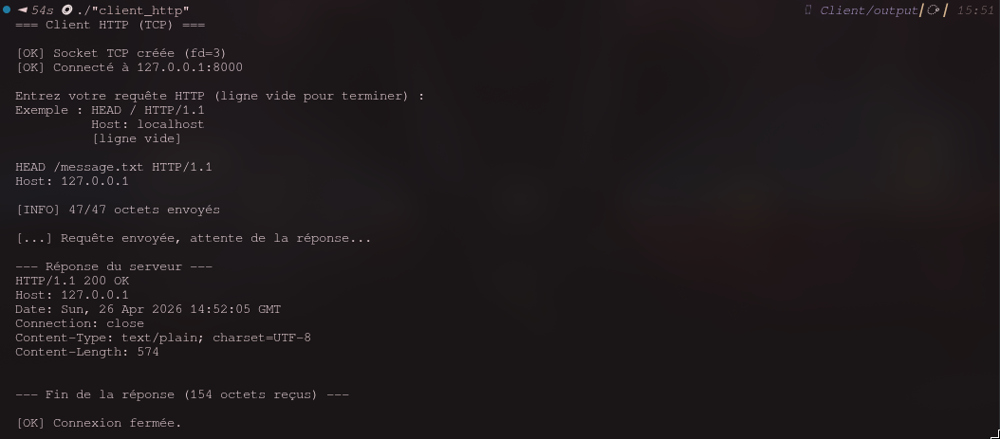
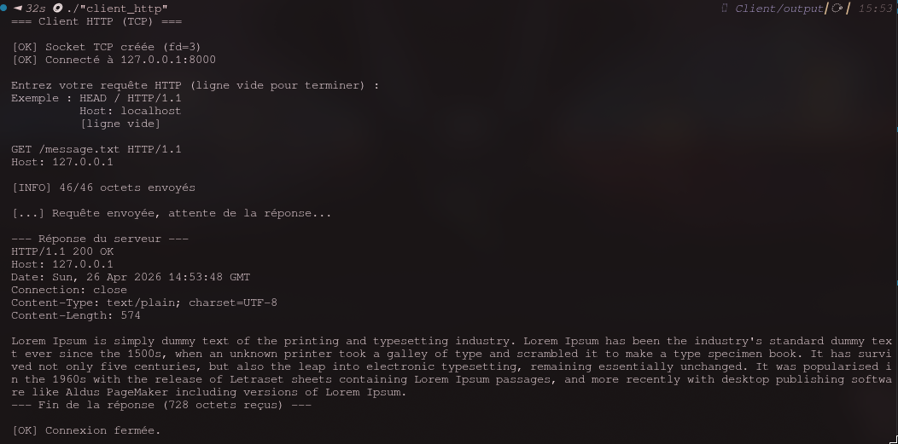

# Partie 2.2 — Client HTTP en mode connecté

## Comment s'établit la connexion ?

### Au niveau TCP

La connexion TCP s'établit via le **3-way handshake** en 3 étapes :

1. Le **client** envoie un segment `SYN` (synchronize) au serveur pour initier la connexion
2. Le **serveur** répond par un `SYN-ACK` (synchronize + acknowledge) pour confirmer
3. Le **client** envoie un `ACK` (acknowledge) pour valider

Ce n'est qu'après ces 3 échanges que la connexion est considérée comme établie et que les données applicatives peuvent circuler.

### Au niveau HTTP

HTTP n'a pas de mécanisme de connexion propre — il utilise simplement la connexion TCP déjà établie. Une fois le handshake TCP terminé :

1. Le client envoie sa **requête HTTP** (ex. `HEAD / HTTP/1.1\r\nHost: localhost\r\n\r\n`)
2. Le serveur traite la requête et renvoie une **réponse HTTP** (code de statut + en-têtes)

HTTP ne négocie rien au niveau connexion : c'est TCP qui garantit la fiabilité et l'ordre des données.

---

## Qui décide de fermer la connexion ? Quand ?

C'est le **serveur HTTP** qui initie la fermeture, immédiatement après avoir envoyé la réponse complète.

La fermeture TCP se fait en **4 étapes** (4-way teardown) :

1. **Serveur → Client** : `FIN` (le serveur n'a plus rien à envoyer)
2. **Client → Serveur** : `ACK` (le client accuse réception du FIN)
3. **Client → Serveur** : `FIN` (le client ferme sa propre moitié)
4. **Serveur → Client** : `ACK` (le serveur confirme)

> En HTTP/1.0, la connexion est fermée après chaque requête/réponse. En HTTP/1.1, le serveur peut maintenir la connexion ouverte (`Connection: keep-alive`) pour plusieurs échanges — mais dans notre cas sans cet en-tête, Apache ferme dès la fin de la réponse.

---

## Quels ports sont utilisés ?

| Côté | Port | Type |
|------|------|------|
| Serveur | **80** | Port bien connu HTTP (fixe) |
| Client | **port éphémère** (ex. 54321) | Assigné aléatoirement par le kernel dans la plage 49152–65535 |

---

---

## Comparaison avec le client `telnet` (question 2.1)

En refaisant la capture Wireshark avec `telnet` à la place de notre programme C, on observe **exactement le même chronogramme TCP/HTTP**.

### Différences observées

| Critère | Notre client C | `telnet` |
|---------|---------------|----------|
| Port source | Port éphémère aléatoire | Port éphémère aléatoire (différent) |
| Délai avant requête HTTP | Quasi-nul (`send()` immédiat) | Plusieurs secondes (saisie manuelle) |
| Envoi de la requête | Un seul segment TCP | Peut envoyer caractère par caractère |
| Protocole TCP/HTTP | Identique | Identique |

### Explication

`telnet` est simplement un **client TCP générique** : il ouvre une socket TCP, puis transmet au serveur tout ce que l'utilisateur tape au clavier, octet par octet. Notre programme C fait exactement la même chose, mais de façon automatisée via `fgets()` + `send()`.

Le protocole réseau sous-jacent est **strictement identique** dans les deux cas — ce que confirme Wireshark : même handshake SYN/SYN-ACK/ACK, même échange HTTP, même fermeture FIN/ACK. La seule différence est applicative : notre programme envoie la requête en un seul appel `send()`, alors que `telnet` peut la fragmenter si on tape lentement (Wireshark montrerait alors plusieurs petits segments TCP au lieu d'un seul).

### Conclusion

Cela démontre que l'interface socket en C nous donne un contrôle identique à celui de `telnet`, mais programmatique. Les deux s'appuient sur les mêmes primitives du kernel (`socket()`, `connect()`, `send()`, `recv()`), et TCP gère de façon transparente la fiabilité, le découpage en segments et le réassemblage.